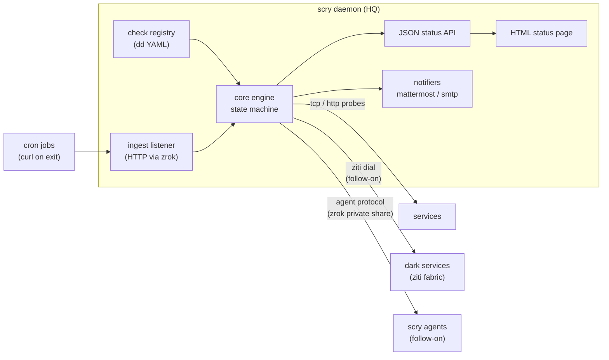

# scry — Specification

*watches everything, listens on nothing*

Status: converged, awaiting implementation. Born 2026-07-23 in a design session; work order drafted 2026-07-24 ([scry-work-order.md](scry-work-order.md)), which records the planning decisions that amended this document — most visibly the deferral of the `ziti` strategy out of v1. Spec and work order passed mercurius review together: six rounds, `ready_to_build`, 2026-07-27.

## The Problem

HQ has no monitoring infrastructure, and it has plenty in motion that needs monitoring. The current state of the art is a set of cron jobs that email a log every day, which get skimmed and deleted. That ritual has almost zero information content — the emails arrive when things are fine, and the one failure they cannot signal is the one that matters: a job that silently stops running produces silence, and nobody notices an absence in an inbox. Beyond the cron jobs there are services scattered across internal and external networks — many of them dark, existing only on the ziti fabric — that need regular health checks, and systems like reef that need richer observation of their own internal condition.

Three apparent problems, but they reduce to two polarities, and then to one model.

Periodic jobs need a dead-man's switch: the job reports on completion, the monitor holds an expectation window, and the alert fires when the report goes missing or arrives failed. Silence becomes the good state — the inversion of the email ritual. Services need active probing: the monitor reaches out and checks. And systems like reef reduce to a variant of active probing once the agent protocol (below) exists: the system embeds a small answering surface, and the monitor asks it questions.

Everything collapses to a single status model: **checks the monitor performs, and reports the monitor expects.** Every monitored thing is green, late, or failed against that model. One view, one notification path.

## What scry Is

A single Go daemon running on an HQ host. It holds a hand-curated registry of checks, evaluates them continuously, maintains a small state machine per check, renders the whole estate's status as one page and one JSON document, and notifies on state transitions. It is a *status* system: it answers "is it healthy right now, and when did that last change" — nothing more.

Expected scale for the first year: roughly 20–30 cron-style jobs, ~20 probed services, and 5–10 agent-answering systems. Call it fifty to sixty entities. Everything about the design is calibrated to that scale — the model lives in memory, rebuilt from configuration at boot, with a small JSON state file preserving last-seen timestamps and current states so a daemon restart neither re-fires alerts nor forgets that something was already late. There is no database.

The design input is HQ, only. The zrok-native agent story (below) gives scry a plausible open-source life and a plausible NetFoundry-relevant narrative, but those are earned consequences of building the HQ tool well, not requirements to design against. V1 ships when it monitors HQ's estate — everything but the agent-answering share, which lands with the agent follow-on.

## The Check Model

**Everything is a check; strategies are active or passive.**

An *active* strategy probes on an interval — dial a TCP port, request an HTTP endpoint and judge the status, dial a ziti service by name. An active check that cannot complete its probe has not errored; it has produced a failing result. A *passive* strategy never probes — its results are the reports that arrive, and the engine judges an expectation window against the last one heard. Both polarities feed the same result type into the same engine; the window itself produces state, never results.

This dissolves the polarity split at the architectural level. Cron jobs, service probes, and self-reporting systems are configuration differences, not structural ones.

Passive expectations are expressed as **period + grace** — "every 24h, grace 2h." The monitor does not parse cron schedules and does not care when a job runs, only that it hears from the job inside the window. This sidesteps schedule parsing and timezone arithmetic entirely, and it is honest about the actual question: has this thing checked in recently enough.

### States and Transitions

Three states: **ok**, **late**, **failed**. Passive checks turn *late* when the window expires — the last report older than period + grace — and harden to *failed* after a further M grace-widths of silence (default 3, configurable): the 24h/2h job is late at 26 hours and failed at 32. Active checks pass through *late* as well: the first failed probe marks the check late, and the Nth consecutive failure (default 3, configurable) confirms *failed*, so a single flaky dial pages nobody and the page never shows green over a check that is mid-failure. A passive check that has never reported measures its window from the moment scry first learned it existed — registration is the baseline, so a check whose curl line never got installed announces itself one window later.

Notifications fire on state *transitions* only, and announcements are paired: entering *failed* always notifies; entering *late* notifies for passive checks (the window blew — that is real information) and is silent for active checks (suspicion under damping, visible on the page only); and a recovery to *ok* notifies exactly when the trouble it clears was announced. A thing that is broken is announced once when it breaks and once when it heals. Every announced transition fans out to every configured notifier — per-check routing is deferred until a real need appears. No repeats, no digests, no escalation ladders — those are deferred, and most of them deliberately forever.

## The Contracts

The core engine owns the state machine — per-check state, transition detection, flap damping — and nothing else. Everything at the edges registers against a contract:

- **`CheckStrategy`** — evaluate and return a result: the active-probe contract. The engine iterates checks; checks own their strategy; the engine never learns what a probe does inside. V1 ships two active strategies, `tcp` and `http`; the `ziti` strategy is deferred to the agent follow-on (see Deferred), which brings the overlay dependency into the process for both at once. *Passive* remains a strategy in the model's taxonomy but implements no probe interface — a passive check's results are its ingest reports, carrying the same result shape into the same engine, and the window arithmetic that judges the silence between them is model logic owned by the engine.
- **`Notifier`** — receive a state transition, deliver it somewhere. V1 ships two: Mattermost — a bot account posting through the shared `theharnessbody/mattermost` client, the same approach sexton proved (amended 2026-07-28 from the original webhook call) — and SMTP. Notifier failures log and retry; they never block the engine.
- **The ingest listener** — not a strategy at all, but a transport surface. It receives reports over HTTP and stamps last-seen (and last-result) onto the corresponding passive check. The status model never learns about HTTP, tokens, or zrok; a different ingest transport can be added beside it later without touching the model.

Configuration is dd-shaped YAML: the check registry, notifier settings, ingest tokens. The registry is hand-curated by design — at this scale, deliberate curation is a feature, and auto-discovery is a non-goal (with one bounded exception under the agent protocol, below). Config failures die loudly at boot; a scry that starts is a scry whose configuration parsed whole.



## Ingest: Reports over zrok

Passive reports travel as plain HTTPS through a zrok share fronting the daemon's ingest listener, authenticated with per-check bearer tokens. The share lives *outside the process* — the daemon binds plain HTTP on localhost and a reserved share fronts it, which is the strongest form of the transport seam: no overlay SDK in the daemon, an ingest surface testable with curl on the box. The cron migration is a one-line change per crontab — replace the `| mail` tail with a `curl` on exit:

```
curl -fsS -m10 https://<ingest>/report/<check-id> -H "authorization: bearer <token>"
```

A bare request means *ok*. A report that has something to say sends the same result shape the agent protocol uses — `{"status": "failed", "detail": "snapshot exited 2"}` — so a job can announce its own failure promptly instead of waiting out the window; that step up from one line is opt-in per job, not the migration baseline.

Works from any host that has curl, which is all of them. The reports are heartbeats, not secrets; per-check tokens bound the damage of a leak to one check's ability to lie about itself. The listener also refuses to disclose which ids exist: an unknown or non-passive id takes the same dummy-hash authentication path and returns the same unauthorized response as a bad token. A ziti-native ingest listener remains a clean later addition precisely because the model/transport seam keeps wire knowledge out of the model.

## The scry Agent Protocol

This section is the load-bearing artifact of the project — more so than any interface inside the daemon, because implementations of it will live in other codebases. It is written so that a stranger can implement a conforming agent in an afternoon, in any language, without reading the daemon's source.

### The shape

A scry agent is anything that answers the protocol over a zrok private share. The agent binds *outbound* into the overlay and listens on nothing — no inbound port, no firewall rule, no allowlist. The host's network posture is unchanged by becoming monitored. The daemon, holding an authorized identity, dials the share and asks; the agent answers its configured checks and returns results. The agent holds no state, pushes nothing, and knows nothing about the daemon.

### The wire

JSON over the share. Versioned envelope from the first byte. Deliberately boring: no negotiation, no streaming, no capability discovery beyond the check list itself.

Request:

```json
{"v": 1, "checks": ["disk-root", "unit-postgres"]}
```

An empty or absent `checks` array means *all*.

Response:

```json
{
  "v": 1,
  "results": [
    {"name": "disk-root", "status": "ok", "detail": "38% used"},
    {"name": "unit-postgres", "status": "failed", "detail": "inactive (dead)"}
  ]
}
```

`status` is one of `ok` | `failed`. That's the whole protocol.

### The rule that keeps the story true

**The protocol has no exec surface.** An agent answers a fixed, configuration-defined set of declarative checks — disk fill, unit status, process presence, application-internal conditions — and nothing else. There is no "run this command," and there never will be. The day an exec convenience appears, the security story collapses into NRPE-with-nicer-transport: the incumbent agent models (NRPE, Zabbix agents, node_exporter on :9100, SSH-key-vault monitoring servers) all require the monitored host to *increase* its attack surface to become observable, and several make the monitor itself a lateral-movement prize. The scry model inverts both: compromise the daemon and you gain the ability to ask agents their configured questions — not shells, not keys; compromise a host and its agent yields nothing toward the daemon.

### Registration and enumeration

The *agent* is the hand-registered unit — one config entry, one share address, one entry in the curated registry. The checks an agent reports enumerate dynamically as its children and roll up into the agent's status: agent unreachable → agent failed, children stale. Curation happens at the boundary that matters (what exists, where it lives); discovery happens within it (what the agent currently watches), so an agent's internals evolve without config churn on the daemon.

### Implementations

Two are in view. The **reference agent** — a small binary for hosts, answering disk/unit/process checks from local config — lands as the first follow-on together with the daemon-side `agent` strategy (see Deferred). And **embedding**: a small Go package letting any long-running application register check functions in-process and expose them over a private share. This is reef's observation story — reef links the package, registers capacity/ingest/integrity checks, stands up a share, and becomes observable without scry learning anything about reef. Push-style passive reports remain for what they are genuinely right for — batch jobs, things not alive to be asked. Alive things answer questions; ephemeral things leave notes.

## Rendering

The status model renders through a single walk: the JSON status API. The model carries no rendering behavior; everything visual consumes the API.

The **dashboard** is a single-page app in the house Vite/React/TypeScript pattern, built into the daemon binary and served by it. It is the first consumer of the status API — there is no second render path; the dashboard eats the same walk of the model everything else does, polling it on a short interval. The discipline: everything on one screen, state-first. A rollup at the top (all green, or N late / N failed), then every check with its state, how long it has been there, and its last transition — trouble sorted to the top, so the page answers its one question ("is everything okay, and if not, what isn't") without a click. How the page is exposed — LAN, zrok private share — is a transport decision outside the model, per the census. Anything that smells like panels, gauges, or history graphs belongs to the metrics deferral, which is permanent — the stack makes those cheap to add, which is exactly why the fence is written down.

The API is also what an eventual MCP tool for the gang would read — that surface is deferred, but the API it would consume is not.

## Scenarios

**A cron job goes silent.** The nightly NAS snapshot job wedges and stops running. No email would ever have announced this. Twenty-six hours after its last report — period 24h, grace 2h — its check turns *late*; a Mattermost message and an email say so. Nothing else happens until it transitions again: to *failed* as the silence hardens, or back to *ok* the moment a report lands, which is announced as a recovery.

**A dark service stops answering** *(follow-on — lands with the `ziti` strategy)*. A service that exists on no network — reachable only as a ziti service — hangs. scry's `ziti` strategy dials it by name on its interval; the first failed dial is damped, the third transitions the check to *failed* and pages. No off-the-shelf monitor could have run this check at all, because the service has no address to probe.

**Reef notices its own trouble** *(follow-on — lands with the agent strategy and embedding package)*. Reef's embedded agent answers its check list on scry's next ask; the `integrity-sweep` child comes back `failed` with detail. The agent rolls up as failed, the notification carries the child's name and detail, and the status page shows exactly which of reef's internals went wrong — while scry itself knows nothing about what an integrity sweep is.

**The daemon restarts.** A kernel update reboots the HQ host. scry comes back, reloads config, reads the JSON state file, and resumes: checks that were *ok* are still ok with their history intact, the thing that was already *failed* is still failed and does not page again. No re-fired alerts, no amnesia.

## Seam Census

Recorded calls, per the census discipline — the decisions review checks diffs against:

- **model / transport** — *separate, unconditional.* Ingest, tokens, zrok, and the agent wire are transport; the status model never sees them. Revisit: never.
- **model / render** — *separate.* The model is declared render-free; the JSON status API is the single walk, and all rendering — the dashboard, the eventual MCP surface — consumes the API. Revisit: never.
- **contract circumvention** — the `CheckStrategy` and `Notifier` interfaces and the agent protocol's answer surface are load-bearing facades; nothing reaches around them. The no-exec rule on the protocol binds every implementer, not just the reference agent. Revisit: never — an exec surface is the one change that voids the design.
- **error by tier** — config failures die at boot, and so does a state file that exists but does not parse whole (a missing one is simply first boot); a failed state *save* is fatal at runtime — scry does not run with state it cannot persist; strategy failures are *results*, not errors; wrap-log-continue lives in the scheduler loop; notifier failures log and retry without blocking the engine. Revisit: if a failure class appears that fits none of the tiers.
- **build first, narrate second** — the open-source and NetFoundry stories about the zrok agent model get told after scry has quietly watched HQ for a while. The narrative is earned by the running system. Revisit: when it has run for a month.

## Deferred (and Why)

**The `agent` strategy and the reference agent binary.** First follow-on, not v1 — it is the only piece requiring a second deployable, and landing it separately is the honest test of whether the strategy contract is real: it must slot in without core changes. The test's terms, sharpened in planning: *frozen* means the transition logic and the `CheckStrategy`/`Notifier` method signatures; additive fields on the result type, the persisted record, and the API are the intended extension point, not a violation — the engine stores and forwards results opaquely, so structure flows strategy → state → API without the state machine ever looking inside. The agent is the check and its children are structured detail on the agent's single result, not first-class checks. The protocol section above is written now precisely so that follow-on implements a settled spec rather than negotiating one.

**The `ziti` strategy.** Deferred out of v1 in planning (2026-07-24). It was the only v1 piece that would pull the openziti SDK into the daemon, and the agent follow-on brings overlay dialing in-process anyway — one dependency event instead of two. It lands alongside the agent strategy; the foreseen shape is a bare-dial strategy plus a ziti dialer option on `http`, keeping transport orthogonal to judgment.

**The embedding package.** Follows the reference agent; reef is its first consumer.

**MCP surface for the gang.** Deferred until the JSON API has stabilized under real use; the MCP tool is a thin reader over it.

**Digests, quiet hours, escalation.** Deferred indefinitely. Transition-only notification at HQ scale should not need them; if it turns out to, that is signal about check hygiene before it is signal about missing features.

**Metrics and time-series.** Deferred *permanently*. scry is a status system. The moment it grows time-series storage and graphs it becomes a bad Prometheus, and the low-maintenance property — the reason it exists — dies with that. If HQ ever needs observability, that is a different tool.

**Auto-discovery.** Deferred permanently, with the one bounded exception already in the design: dynamic enumeration of a registered agent's children. The registry stays hand-curated. At fifty entities, curation is cheap and drift is visible; discovery machinery would cost more than it saves.
